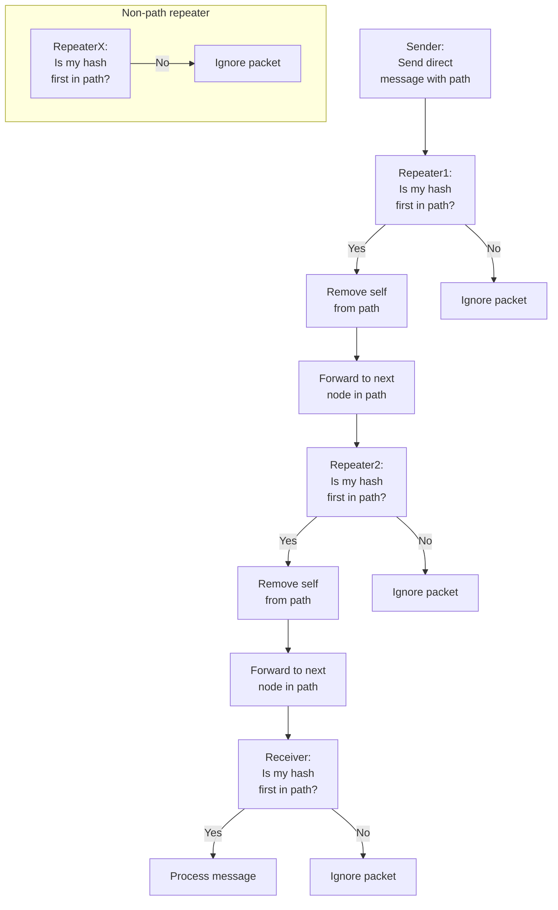
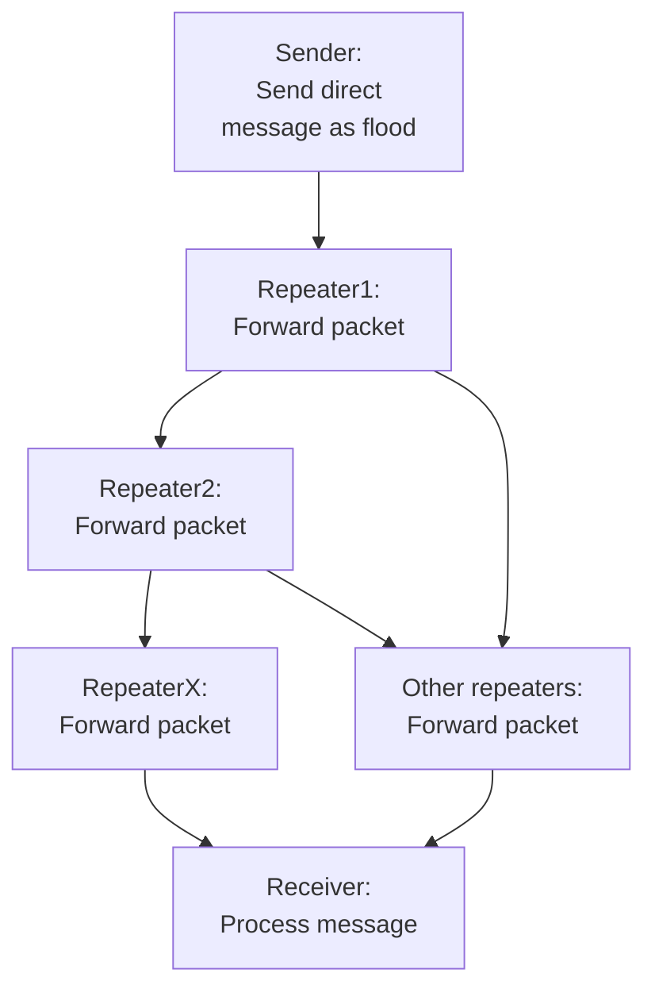
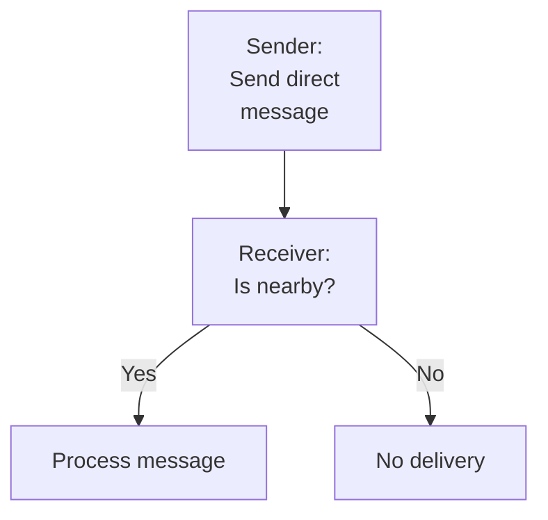

# Direct Message Flows in MeshCore

This document explains how direct messages (DMs) are routed in MeshCore, focusing on three scenarios:
- Direct message with a set path
- Direct message as a flood
- Direct message as direct (client-to-client, nearby)

## General Information

A direct message (DM) in MeshCore is a secure, private packet sent from one node to another. For two nodes to exchange direct messages, both must have each other's public key and be added as contacts. This ensures that only intended recipients can decrypt and validate messages.

**Encryption and Validation:**
- The sender encrypts the message using the receiver's public key.
- The receiver decrypts the message using their private key, ensuring confidentiality and authenticity.
- This mechanism prevents eavesdropping and guarantees that only the intended recipient can read the message.

**Contact Requirement:**
- Both sender and receiver must have exchanged public keys and be present in each other's contact list.
- This is typically done during an initial handshake or contact exchange process.

**Routing Types:**
- **Set Path:** The sender specifies a list of nodes (repeaters) that the message must traverse. Only nodes in the path forward the message; others ignore it.
- **Flood:** The message is broadcast to all nodes, and every repeater forwards it until it reaches the destination or a TTL expires.
- **Direct (Nearby):** The message is sent directly from one client to another if they are within radio range, without involving repeaters.

Direct messages are designed for privacy, reliability, and flexibility in routing, making them suitable for secure communication in mesh networks.

---

## 1. Direct Message with a Set Path

---

## 2. Direct Message as Flood

---

## 3. Direct Message as Direct (Client-to-Client, Nearby)

---

## Summary

- **Set Path:** Only specified repeaters forward the message.
- **Flood:** All repeaters forward the message until it reaches the destination.
- **Direct (Nearby):** Message is delivered directly if the receiver is within range.
